# 🏠 HomeOps — Ansible 驱动的家庭运维自动化平台


> **TL;DR**  
> HomeOps 是一个面向个人/家庭基础设施的自动化平台：以 **Ansible** 为引擎、以 **GitHub Actions** 为流水线、以 **“金路径” Make 目标** 为契约，串起从开发 → 验证 → 部署 → 观测的全链路。  
> 人类与 AI 统一走这 4 步：`make setup → make lint → make test → make itest(部署+验证) → (make deploy)`。
> 机判口径唯一来源：`docs/verification-spec.md`。AI 指南：`AGENTS.md`。

---

## 🧭 愿景 & 范围

- **统一入口**：作为家庭设备与服务的**唯一自动化出口**（Linux / Windows / macOS，未来可扩至 iOS / Android 辅助脚本）。  
- **智能调度**：支持工作站在 **Linux / Windows** 间**无人值守切换**，按场景（开发/游戏）弹性调度。  
- **可观测基座**：逐步落地 **Loki + Alloy + Grafana**，为 AIOps / AgentOps 提供数据与证据。

技术基座：

- ⚙️ 配置管理：**Ansible**
- 🧪 CI/CD：**GitHub Actions**
- 🖥️ 运行器：**Self-hosted Runner**（`ctrl-linux-01`）
- 🌐 私网：**Tailscale**

---

## 🧱 我们的“金路径”（The Golden Path）

> **任何改动都只通过以下目标来驱动与验证。**  
> Gate0 是可选引导，其余 Gate1/Gate2 为质量门。

```bash
make setup   # Gate0: 自托管运行器的一次性引导（虚拟环境、Ansible 工具链、Collections/roles）
make lint    # Gate1/Step1: 静态检查（ansible-lint / yamllint / syntax-check）
make test    # Gate1/Step2: 本地无破坏检查（check mode、幂等探针）
make itest   # Gate2: 部署+验证组合拳（自托管 Runner，先部署再按 Spec 验证）
# (条件) 仅当 Gate2 绿灯：
make deploy  # 正式释放（人工/主干触发）
```

**判分权威**：`make itest` 的通过/失败 **只看** [`docs/verification-spec.md`](docs/verification-spec.md)。  
**AI 操作手册**：编排规则与提示见 [`AGENTS.md`](AGENTS.md)。

### 🛤️ CI 跑道分离（云/本地）

```mermaid
flowchart LR
  A[Dev/PR 提交] --> B{Gate1 云端\nubuntu-latest}
  B -->|lint/test 绿| C[合并/Push]
  B -->|红| Bx[修复再跑]
  C --> D{Gate2 自托管\nctrl-linux-01}
  D -->|itest 绿| E[可条件触发 deploy]
  D -->|红| Dx[收集工件 & 逐条修复]
```


- **Gate1（云）**：快速反馈语法、风格与无破坏检查。  
- **Gate2（本地）**：单一 `make itest` 同时负责部署与验证（以 Spec 为准）。
- **文档变更**：对纯文档/规范，可启用 docs-only bypass（快速合并，保持节奏）。

---

## 🗂️ 目录结构（Repository Layout）

```text
.
├─ .github/workflows/        # CI 工作流（质量门 & 条件部署）
├─ inventory/                # Ansible 主机清单（hosts.yaml 等）
├─ playbooks/                # 剧本（部署 / 验证 / 引导）
│  ├─ deploy-observability-stack.yml
│  └─ tests/
│     └─ verify_observability.yml
├─ templates/                # 模板（*.j2）
├─ scripts/                  # 辅助脚本（Shell / PowerShell）
├─ docs/
│  ├─ verification-spec.md   # Gate2 的唯一判分口径（机器可验证）
│  └─ README-assets/         # README 相关图示/素材（可选）
├─ AGENTS.md                 # 给 AI 的“作业指导书”
└─ Makefile                  # 金路径契约（setup/lint/test/itest/deploy）
```

---

## 🚀 快速开始（Quickstart）

> 以下命令默认在 **自托管运行器**（`ctrl-linux-01`）上执行。

1. **拉起工具链**
   ```bash
   make setup
   ```

2. **本地质量门（云端与本地均可）**
   ```bash
   make lint
   make test
   ```

3. **集成测试（自托管 Runner）**
   ```bash
   make itest
   ```

4. **（可选）部署**
   ```bash
   make deploy  # 仅当 Gate2 通过
   ```

> **Fork PR 注意**：如从 fork 提交 PR，需要在 Actions 页面点击 **“Approve and run”** 才能调起自托管任务。

---

## 🔎 可观测性里程碑（当前重点）

目标：在 `ctrl-linux-01` 上落地 **Loki + Grafana**，并在所有 Linux 主机（含 `ws-01-linux`）部署 **Alloy** 采集 journald 日志，最终能在 Grafana 中查询：

- `loki` / `grafana-server` / `alloy` 均为 **active (running)** 且 **enabled**；  
- `http://127.0.0.1:3100/ready` 返回 200；Grafana `/api/health` 返回 200/401；  
- Loki 查询 `{job="systemd-journal"}` 能检索到 **每台主机≥1 条** 且 **≤10 分钟** 的日志。

**实现位置**：
- 部署：`playbooks/deploy-observability-stack.yml`  
- 验证：`playbooks/tests/verify_observability.yml`（口径详见 `docs/verification-spec.md`）

```mermaid
sequenceDiagram
  autonumber
  actor Dev as 开发者/AI
  participant Repo as HomeOps Repo
  participant CI1 as Gate1 (Cloud)
  participant CI2 as Gate2 (Self-hosted)
  participant Hosts as ctrl-linux-01 & linux group

  Dev->>Repo: 提交 PR / Push main
  Repo-->>CI1: 触发 lint/test
  CI1-->>Dev: 语法/风格结果(快)
  alt Gate1 通过
    Repo-->>CI2: 触发 itest（自托管）
    CI2->>Hosts: 部署到影子/验证环境（或探针）
    CI2-->>Dev: 机判结果 + 工件
    opt 通过后
      Dev->>Repo: 触发 deploy（条件）
    end
  else Gate1 失败
    Dev->>Repo: 对症修复再跑
  end
```



---

## 🤝 协作规范（Humans & AIs）

- **一事一议**：每个 PR **只绑定一个 Issue**；便于回归与回溯。  
- **提交模板**：PR 描述需包含：
  - **变更摘要**（1–2 句）  
  - **Testing Done**（四个命令关键输出或 CI 链接）  
  - **追踪区块（可选）**：
    ```md
    <!-- codex-meta v1
    task_id: OBS-STACK-001
    domain: homeops
    iteration: 1
    network_mode: setup-only
    -->
    ```
- **命名与模块**：按 `inventory/hosts.yaml` 的主机与分组命名；Windows 任务使用 `ansible.windows.win_*` 原生模块。  
- **严格走金路径**：不要引入平行命令；避免绕过质量门。

---

## 📦 Gate2 Artifact 自动取证

- 新增工作流 **Gate2 Artifact Retriever**（`.github/workflows/gate2-artifact-retriever.yml`）。
- 触发条件：`HomeOps PR Quality Gates` workflow_run 完成且总体结论为 failure，并且 Gate2 job 失败。
- 行为：自动调用 GitHub Actions API 拉取源 run 的 `gate2-artifacts` 压缩包，并在本次 run 中重新上传到
  `gate2-artifacts-<run_id>/`，方便后续诊断回合直接引用。

---

## 🧰 常见问题（Troubleshooting）

- **“waiting for a runner to pick up this job…”**  
  - 确认自托管 Runner **Online/Idle**（Settings → Actions → Runners）  
  - Fork PR 需要 **Approve and run**  
  - 标签匹配使用 `self-hosted`（或根据仓库配置）
- **`ansible-playbook: No such file or directory`**  
  - 先执行 `make setup`；确保系统有 `python3-venv`（Ubuntu `apt install python3-venv`）。
- **`Error loading plugin 'community.general.yaml'`**  
  - 运行 `make setup` 以安装所需 Collections 与 lint 插件。  
- **网络/连通性失败**  
  - 检查 Tailscale/SSH；确保 `inventory/hosts.yaml` 主机名可达。
- **服务未知状态**  
  - 查看 `artifacts/itest/` 工件中的服务状态与日志片段，按 Spec 对症修复。

---

## 🗺️ 路线图（Roadmap）

- [X] **#26** 文档与金路径对齐（AGENTS.md ↔ verification-spec.md）  
- [X] **#27** 机判验收闭环：`verify_observability.yml` 全绿  
- [X] **#28** 部署闭环：`deploy-observability-stack.yml` + 轻量回归  
- [ ] 扩展：接入更多服务与主机群、AgentOps 策略、经验工件沉淀

---

## ❤️ 致谢

- **Ansible**, **GitHub Actions**, **Grafana Loki/Alloy/Grafana**, **Tailscale** 等优秀开源生态。

---

## 📄 许可（License）

当前许可：**TBD（内部迭代中）**。如需外部复用或开放，请先与仓库维护者沟通。

---

> 📌 **面向 AI 的温馨提示**  
> - 请首先阅读 `AGENTS.md`，按其中“金路径”执行；  
> - Gate2 的判分仅以 `docs/verification-spec.md` 为准；  
> - 仅在通过 Gate2 后再尝试 `make deploy`；  
> - PR 请附 `Testing Done` 与（可选）`codex-meta` 追踪区块。

